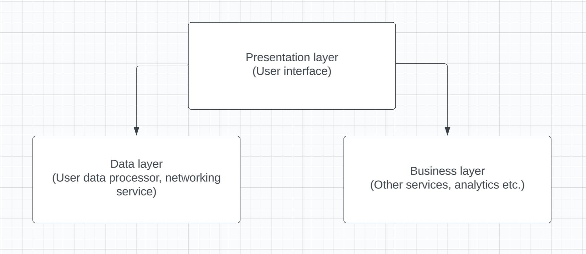
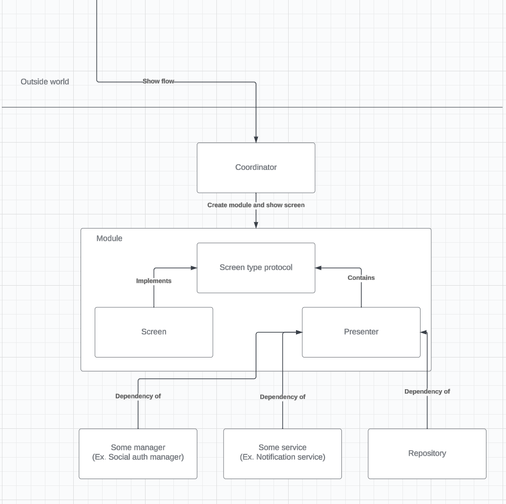
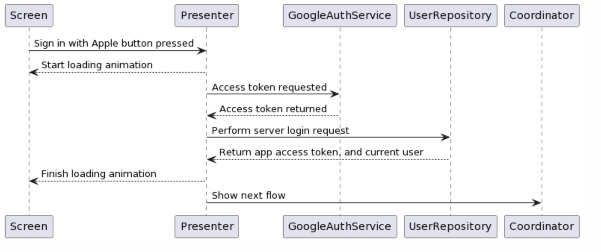
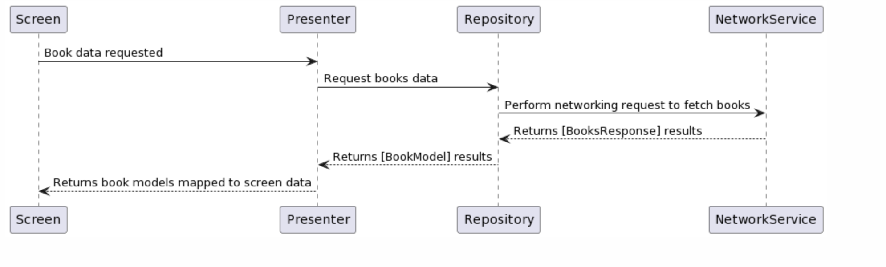

# Template-ios

# Project setup

## Rename project

- Navigate in terminal into project directory
- Run `./rename.swift "Template" "YOUR_PROJECT_NAME"` command in terminal

## Setup cocoapods

- If you do not have cocoapods installed, install it(preferrably via `brew`)
- Install pods by running `pod install` command

## Setup SPM

- In Xcode select **Reset Package Cache** action
- In Xcode select **Update to Latest Package Version** action

## Update settings

- Change bundle ids to new one
- Change Firebase plist files to your

# Project architecture overview

# General

At Nerdzlab, we employ the latest version of Swift as our programming language for crafting iOS applications. Our chosen framework for building user interfaces is UIKit.

UIKit was chosen because:

- It is a well-established and mature framework, providing stability and reliability for iOS app development
- It has widespread adoption and support within the iOS developer community.
- UIKit provides a high level of flexibility, enabling developers to customize the appearance and behavior of UI elements to meet specific design requirements.
- Built-in support for animations and physics-based interactions through UIKit Dynamics allows for the creation of engaging and visually appealing user interfaces.
- UIKit seamlessly integrates with native iOS features, enabling easy access to device-specific capabilities like the camera, location services, and sensors.
- UIKit is optimized for performance, providing efficient rendering and responsiveness for smooth user interactions.

MVP was chosen because of these benefits:

- MVP enforces a clear separation of concerns between the model (data and business logic), view (user interface), and presenter (mediator between the model and view). This separation makes the codebase more modular and maintainable.
- MVP is designed to be highly testable. The presenter, which contains the application’s logic, can be tested independently of the UI (view). This facilitates unit testing, making it easier to verify the correctness of the application’s business logic.
- MVP allows for greater flexibility in terms of UI updates. The presenter is responsible for updating the view based on changes in the model. This flexibility can be beneficial in scenarios where the same model may be represented in different ways in the user interface.
- MVP often reduces the dependency on specific UI frameworks. The view in MVP is generally kept as “dumb” as possible, responsible for displaying data and forwarding user inputs to the presenter. This can make it easier to switch or upgrade UI frameworks.
- With the separation of concerns, the codebase tends to be more maintainable. Changes to the user interface or business logic can be made with minimal impact on other components, reducing the risk of introducing bugs during updates.With the separation of concerns, the codebase tends to be more maintainable. Changes to the user interface or business logic can be made with minimal impact on other components, reducing the risk of introducing bugs during updates.
- MVP follows a consistent design pattern that is easy to understand. This can be advantageous for development teams as it provides a clear structure for organizing code and makes it easier for new team members to get acquainted with the project.
- The communication flow in MVP is straightforward. The view communicates user input to the presenter, the presenter manipulates the model, and updates the view accordingly. This simplicity in communication can enhance code readability.
- MVP is seen as an evolution of the Model-View-Controller (MVC) pattern, addressing some of its limitations, especially in terms of testing and maintaining large codebases. Teams already familiar with MVC might find MVP to be a natural progression.

# High-level app architecture

Each application consists of three layers: - Presentation layer. This layer is responsible for the user interface, UI components, and user communication with the application. The presentation layer consists of mvp modules that represent separate screens in the app, coordinators, and views that are used in user interface development. For navigation we use coordinators. - Data layer. This layer is responsible for fetching the data from local storage or server. - Business layer. This layer is responsible for different services and managers. For example user notification manager, analytics service, etc.



## Presentation layer.

The presentation layer is separated by stories. Each story is unique app flow that could be called from different parts of the application. Ex. Login flow - authorization story. Each story must have a Coordinator. Each coordinator should contain a navigation processor. The navigation processor is an object that is responsible for navigation action executions. An additional level of abstraction allows developers to easily implement split screen navigation and more.



### Coordinator

Code for coordinator abstraction.

```swift

protocol BaseCoordinatorType {
    @discardableResult
    func start(completion: EmptyAction?) -> BaseScreenType
}

```

The sample implementation of this protocol for a coordinator that should open the settings page

```swift

import UIKit

final class SettingsCoordinator: BaseContentCoordinator {

    var onClose: EmptyAction?

    @discardableResult
    override func start(completion: EmptyAction?) -> BaseScreenType {
        setupInitialState(completion: completion)

        return navigationProcessor.container
    }

    private func setupInitialState(completion: EmptyAction? = nil)  {
        let screen = SettingsScreen()
        let presenter = SettingsPresenter(screen)

        presenter.onClose = { [weak sekf] in
            self?.onClose?()
        }

        navigationProcessor.registerCoordinator(self, in: .primary, with: screen)
    }

}

```

Let's take a deeper look into specific screens for the story. Each screen is a module built using MVP architecture. Each MVP module consists of: - Screen - represents the UI of the screen. - Presenter - an object that controls screen logic, this object should connect business logic and data layer with screen UI. - ScreenTypeProtocol - a protocol that defines the screen public interface for screen presenter communication.

Here is a sample communication diagram for the auth screen module.



Let’s take a deeper look at mvp module components.

### ScreenTypeProtocol

This component is responsible for declaring screen and presenter communication protocol

- * Rules: **
1. Every `ScreenTypeProtocol` should be inherited from `BaseScreenType`.
2. Every change that will affect UI should be done in functions that are marked as @MainActor.

**Example:**

```swift
protocol ProfileScreenType: BaseScreenType {
    var onClose: EmptyAction? { get set }
    var onDelete: EmptyAction? { get set }
    var data: ScreenDataType? { get }

    @MainActor
    fund setData(_ data: ScreenDataType?)
}
```

### Screen

This element contains only UI logic and does not have any connection with other parts of the application.

- * Rules: **
1. Every `Screen` element should be inherited from `UIViewController`
2. `Screen` should never use any element not related to UI part
3. `Screen` should delegate all actions not related to UI to `Presenter` via closures

**Example:**

```swift
final class ProfileScreen: BaseScreen, ProfileScreenType {

    // MARK: - Completions -
    var onClose: EmptyAction? { get set }
    var onDelete: EmptyAction? { get set }

    var data: ScreenDataType?
    ...
}
```

### Presenter

This element controls some `Screen` element and suits as a bridge betwen `Screen` and another world.

- * Rules: ** 1. `Presenter` should never work with `Screen` directly, but should communicate via `ScreenTypeProtocol`. 2. Every service, manager or data repository shoul be injected and not just inited in presenter. 3. `Presenter` should not perform any navigation actions by himself, but he should transfer this responsibility to coordiantors.
- * Example: **

```swift
import UIKit
import NerdzInject

final class SettingsPresenter: BasePresenter {

    // MARK: - Properties(public) -

    var onLogout: EmptyAction?
    var onClose: EmptyAction?

    // MARK: - Dependencies -

    @ForceInject private var userRepository: UserRepositoryType

    private weak var screen: ProfileScreenType?

    init(scren: ProfileScreenType) {
        self.screen = screen

        super.init()

        setupScreen()
    }

    private func setupScreen() {
        screen.onLogout = { [weak self] in
            self?.handleLgout()
        }

        screen.onDelete = { [weak self] in
            self?.handleDelete()
        }
    }

    private func handelLogout() {
        // TODO: Logout
    }

    private func handleDelete() {
        // TODO: Delete
    }
}
```

## Data layer

Data layer is responsible for fetching and transforming user data into models that could be used in any story presenters. Data layers consists of repositories, networking requests, networking service implementation and local storage implementation if ofline mode is needed.

### Repository

This element is responsible for data operations on server of storage. We use different models for storage, networking and repositories, to separate each layer and give us the most amound of freedom and ease to change models without braking app behaviour.

**Rules:**

1. `DataRepository` should be responsible only for fetching and writing one type of models
2. If `DataRepository` has API calls inside - responses should be re-mapped into new structures
3. Preferrable to have one `DataRepository` of specific class that will be injected into `Presenter`
4. `DataRepository` is responsible for notifying everybody about data changes. Preferrably via `NerdzEvent` or `Combine`
5. `DataRepository` can contain the state of a system if needed(Ex: connection to database or sockets).
6. `DataRepository` should not perform any operations with UI.
- * Example: **

```swift

protocol NersRepositoryType {
    func getNews() async throws -> [NewsModel]
}

final class NewsRepository: NersRepositoryType {
        func getNews() async throws -> [NewsModel] {
            let response = GetNewsRequest().asyncExecute()
            let mapped = response.map(NewsModel.init)

            return mapped
        }
}
```

# General data structure

To keep each layer of the application not depended from each other our architecture provide separate models for network requests, repositories and screens. Using this approach helps us to not rely on correct server or service response to show on the UI. Using separate models gives us an ability to make the app as flexible as possible.

Let’s look into example for simple books list module.

```swift
protocol BookListBookType {
    var name: String { get }
    var author: String { get }
    var releaseDate: Date { get }
}

protocol BookListScreenType: BaseScreenType {
    var books: [BookListBookType] { get }

    @MainActor
    func setBooks(_ books: [BookListBookType])
}
```

The screen model type contains only needed properties. Having not rely on repository model makes fetching data from different sources much easier, we should provide just different models that implement `BookListBookType` protocol.

The next data model that would be used in the app is repository model. This modle should be used in repositories and presenters. This model would be mapped into screen type models and displayed on the screen.

```swift
struct BookListModel {
    let id: Int
    let name: String
    let author: AuthorModel
    let releaseDate: Date
}
```

But to get to the repository model we should fetch data from the server. To minimize response mapping erros we introduce a response model.

```swift
struct BookResponse: Codable {
    let id: Int
    let name: String
    let author: AuthorResponse
    let releaseDate: Date
}
```

Here is the sample communication diagram for a module that displays list of books.


